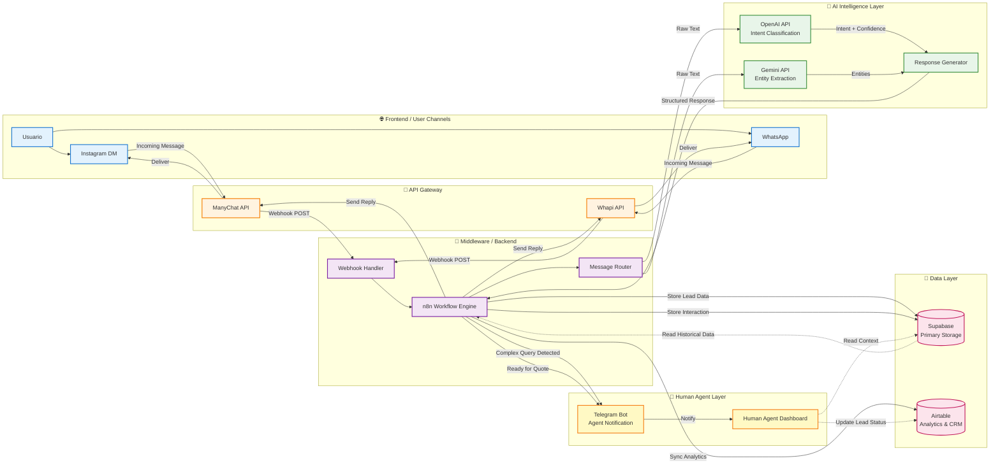

# ✈️ Travel Agency 

> Short summary
> Built a lightweight, privacy-minded conversational system for a travel agency to qualify and capture leads for city tours and travel services. The bot handled initial qualification, captured contact info, and handed off warm leads to a human agent for quoting and booking. This README highlights the problem, the solution, results and lessons — suitable to show to recruiters or stakeholders without exposing implementation details.

---

## 📄 Overview

This project is a production-minded MVP that automates the front-end of the sales funnel for a travel agency: identify intent (city-tour, travel insurance, other), capture minimal but high-value data (name, WhatsApp, destination, dates, party size, main interest), and route qualified leads to a human closer to finish quotes and bookings.

The system was built as a composed automation: a chatfront (ManyChat), two workflow orchestrators (n8n and make.com), lightweight storage/analytics (Supabase / Airtable), and AI components (OpenAI and Gemini for NLU/assistant tasks). It was tested with a short ad push to validate assumptions and measure early KPIs.

> Status: **Not active** at the moment — the repo contains the project summary and artifacts (screenshots, flow diagrams). Implementation details and credentials are intentionally omitted.

---

## 🎯 The Problems

Travel agencies often lose a majority of inbound web / social traffic because:

* Visitors don’t know what to ask or where to start in a new city.
* Manual qualification (calls / DMs) is slow and inconsistent.
* Ads and social campaigns generate clicks but not always qualified contacts or phone numbers.
* Agencies need a low-friction way to convert interest into a WhatsApp lead (where most bookings close), while keeping the human in the loop for final pricing and payments.

This project aimed to prove a simple automated conversational flow that:

* reduces time-to-response,
* captures usable contact data, and
* increases the volume of human-ready leads for sales follow-up.

---

## 💡 The Solutions

A lightweight conversational funnel that:

1. **Identifies intent** immediately (city-tour, insurance, other) and asks for the visitor’s name (micro-commitment).
2. **Surfaces core motivations** (e.g., gastronomy, history, adventure, nightlife) so leads are pre-segmented for tailored follow-up.
3. **Captures minimal booking data** (WhatsApp, destination, date, # people) so a human agent can send a precise quote and finalize the booking on WhatsApp.
4. **Hands off** to a human whenever price/complexity is required or when retries are exhausted.

This kept the automation focused on qualification and handoff — maximizing safety (no payments, no automation of legal confirmations) while improving lead throughput.

---

## 🛠️ Tools Used

High-level stack (no step-by-step instructions included here):

* **ManyChat** — chat front for Instagram specifically (web / social messaging flows and quick replies)
* **Webhooks** — workflow receiver and publisher (connecting, routing, transferring, triggers)
* **make.com** — workflow orchestration (routing, validations, enrichment triggers)
* **n8n** — workflow orchestration (routing, validations, enrichment triggers)
* **Supabase** — raw lead store/DB (lightweight, transactional data)
* **Airtable** — analytics & reporting dashboards for the agency
* **OpenAI API** — natural language understanding & assistant prompts (used for intent/slot normalization and conversation polishing)
* **Gemini API** — natural language understanding & assistant prompts (used for intent/slot normalization and conversation polishing)
* **Telegram** — internal notifications / ops alerts

---

## 📸 Demo / Workflow

### 1. System Architecture
> The following diagram illustrates the data flow from initial user contact to final lead storage. It highlights how the orchestration layer (n8n/Make) acts as middleware between the frontend chat interface (ManyChat) and the logic/storage layers (OpenAI, Supabase)

#### 1.1 Conversation Logic (User Flow)

🔎 Click to view the detailed conversation decision tree

Note: A sanitized version of the workflow blueprint (Appointment Assistant.blueprint.json) is available for review in the repo files.

### 2. The Automation Logic (Make)

### 3. The Messaging flows (Manychat)

---

## 📈 Results (3-day paid test & initial manual trials)

Numbers from the first and only short run (three-day ad push + organic testing). These are approximate and reported as observed during the test:

* **Ad spend:** $10 (3 days)
* **Total interactions handled (approx):** ~45
* **Automated immediate responses by chatbot:** 23
* **Total leads recorded:** 24
* **Leads from WhatsApp organic (direct non-paid):** 3
* **Paid-ad leads (approx):** 20
* **Cost per lead (CPL) for paid ads:** $10 / 20 = **$0.50 / lead**
* **Sales / conversions recorded during this test:** 2

**Interpretation:** the experiment validated acquisition efficiency (very low CPL) and that the bot can handle immediate qualification at scale. The follow-up process and payment flow require further optimization.

---

## 🔍 Insights & What Worked

* **Low friction first touch:** Asking for a name + intent upfront increases micro-commitment and reduces drop-off.
* **Motivation-driven routing:** Capturing the lead’s main interest (e.g., gastronomy vs history) allows highly relevant follow-ups and better segmentation for human agents.
* **Cost-effective paid acquisition:** Small ad spend produced a meaningful number of leads at a very low CPL.
* **Hand-off model:** The combination of bot + human handoff prevents over-automation risk and preserves conversion quality.

---

## ⚠️ What I Would Improve (next iteration)

The MVP proved the concept but highlighted several improvement areas to increase conversion to paid bookings:

* **Stronger booking funnel on WhatsApp:** streamline quote→payment→confirmation flow (payment integrations, booking confirmations).
* **Faster and richer follow-up templates:** pre-built WhatsApp templates tailored to `main_concern` to shorten time-to-quote.
* **Qualification scoring:** add lead scoring so agents prioritize hottest prospects.
* **A/B testing copy & CTAs:** test variations of the “main concern” prompt and the minimum-data ask to optimize data capture vs. friction.
* **Re-engagement flows:** automated reminders for leads with incomplete data.

---

## 📚 Lessons learned

* Micro-commitments (name + intent) significantly increase engagement.
* Segmenting by primary motivation enables more personalized quotes and more relevant upsells.
* Early-stage experiments benefit from small ad spends to validate unit economics quickly.
* Capture of a phone number is the single most important variable for downstream conversion via WhatsApp.

---

## 📬 Contact

--Gabriel Elias Flores--
Linkedin: https://www.linkedin.com/in/gabriel-elias-flores-440413342
Email: gabrielias28e@gmail.com

---
