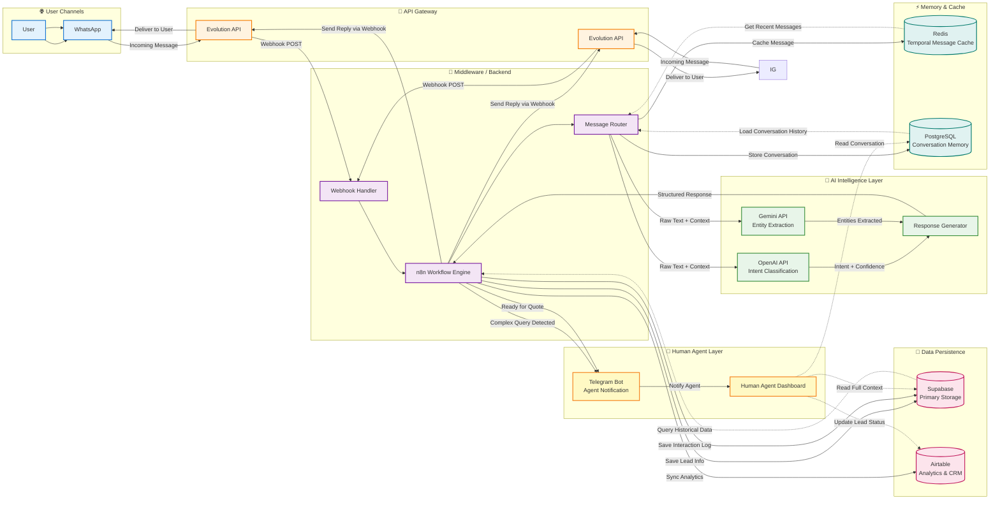

# 🏥 Medical AI Secretary

## 📄 Overview

A production-ready WhatsApp-based virtual assistant and scheduling system built for a private practice. Designed to reduce administrative load for a doctor’s office by automating appointment booking, intake collection, and basic triage — while handing off sensitive or exceptional cases to humans.

Client: **Dr. Marco S.**
Status: **Deployed and operating** (initial real-world roll-out, live conversations processed).

---

## 🎯 The Problem

Doctors and clinics waste time on repetitive administrative tasks that add up across the day:

* Manual booking and calendar updates.
* Typing patient intake and notes after consultations.
* Receiving payment receipts via chat without a reliable verification process.
* Burnout caused by juggling patient care and administrative work.

This creates delays, errors, and a poor patient experience.

---

## 💡 The Solution 

An automated workflow that:

1. **Handles initial patient contact completely** via WhatsApp (greeting, intent classification, simple triage).
2. **Offers and confirms appointment slots** by connecting to the doctor’s calendar and creating events.
3. **Collects intake data** (pre-consultation form) and stores it in a centralized database for clinician review.
4. **Routes exceptional cases (payments, same-day arrivals, “I’m already here”)** to a human channel (Chatwoot) for manual confirmation.
5. **Provides a clear handoff** to clinic staff when human attention is required, avoiding mistaken automation in urgent or ambiguous scenarios.

The system was intentionally designed with conservative decision rules: it does not auto-authorize payments or perform clinical decisions — it collects, triages, and forwards.

---

## 🛠️ Tools & Components (high-level)

* **n8n** — workflow orchestration and transformations
* **OpenAI API** (Whisper & GPT) — NLP for message understanding and audio transcription
* **Airtable / Google Sheets / Supabase** — structured storage for intake and logs, and creation of DB at the same time
* **Evolution API / ManyChat** — WhatsApp gateway (BSP / agent)
* **Chatwoot** — inbox for human handoffs and support
* **Google Calendar / Google Docs** — appointment source of truth and templated documents
* **Make.com (optional)** — alternative orchestration when needed

> Note: This README focuses on outcomes and architecture — detailed implementation and scripts are not included to protect IP.

---

## 🧭 High-level architecture

WhatsApp (patient) → WhatsApp BSP (Evolution / ManyChat) → NLP layer/HTTPS/WEBHOOKS (intent + entity extraction) → orchestration (n8n) → storage (Airtable/Sheets/Supabase) → calendar writes (Google Calendar) → Chatwoot (human handoff & monitoring)

(OpenAI/Gemini used for message interpretation and optional audio transcription and images interpretation.)

---

## 📸 Demo / Workflow

### 1. System Architecture
> The following diagram illustrates the data flow from initial user contact to final lead storage. It highlights how the orchestration layer (n8n) acts as middleware between the frontend chat interface (Evolution API) and the logic/storage layers (OpenAI, Gemini, Supabase, Redis, Postgres)

#### 1.1 Conversation Logic (User Flow)

🔎 Click to view the detailed conversation decision tree

### 2. The Automation Logic (n8n)

Note: A sanitized version of the workflow blueprint with a few different changes (Mainly based on Airtable Modules) and the placeholder [Replace] to personalized (Appointment Assistant.blueprint.json) is available for review in the repo files.

### 3. Patient Experience (WhatsApp)

### 4. Admin View (Chatwoot Handoff)

---

## 🔧 Challenges encountered & fixes

**Issue:** Patient sent payment receipt and claimed a same-day appointment five minutes before the scheduled time. The bot attempted to follow the normal booking flow and mistakenly rejected same-day availability, producing friction. Patient reacted negatively.

**Root causes:**

* Secretary/clinic routed a live, time-sensitive case into a channel not yet configured for urgent exceptions.
* The bot lacked a robust detector for “already-scheduled / in-clinic / payment proof” inputs.

**Immediate fixes implemented:**

1. **Payment/receipt handling:** Bot now acknowledges receipts and forwards them to staff for manual verification. Bot does not assume payment validity.
2. **Same-day logic:** Bot no longer auto-rejects near-term requests; instead it escalates to a human for confirmation.
3. **“Already-here” detector:** Keywords trigger an immediate human notification and a short, empathetic acknowledgment to the patient.
4. **Slot memory:** If a suggested time is accepted, the assistant stores it as the confirmed proposed slot and avoids re-asking.

---

## 📚 Lessons learned

* Real patients and staff introduce edge cases that don't appear in synthetic testing. Expect them; design for graceful escalation.
* The human-in-the-loop pattern is essential for payments, emergencies, and administrative exceptions.
* Communication and process alignment with clinic staff (especially receptionists) is as important as technical robustness. Train the clinic on what to route to the bot vs. human channels.
* Deploy conservatively: run internal testing, then limited external testers, then open to real patients.

---

## 📬 Contact

--Gabriel Elias Flores--
Linkedin: https://www.linkedin.com/in/gabriel-elias-flores-440413342
Email: gabrielias28e@gmail.com

---
